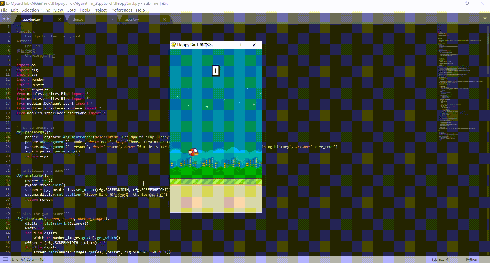

# AIFlappyBird
```
The second algorithm(pytorch version) to play FlappyBird.
```

# Introduction in Chinese
https://mp.weixin.qq.com/s/8KCuDzSG4uEZe4qAnHIedA

# Environment
```
OS: Ubuntu 16.04(train) / Windows10(test)
Graphics card: Tian XP(train) / 1050Ti(test)
Python: Python3.5+(have installed necessary dependencies)
```

# Usage
```
usage: flappybird.py [-h] [--mode MODE] [--resume]

Use dpn to play flappybird

optional arguments:
  -h, --help   show this help message and exit
  --mode MODE  Choose <train> or <test> please
  --resume     If mode is <train> and use --resume, check and load the
               training history
```

# Game Display
